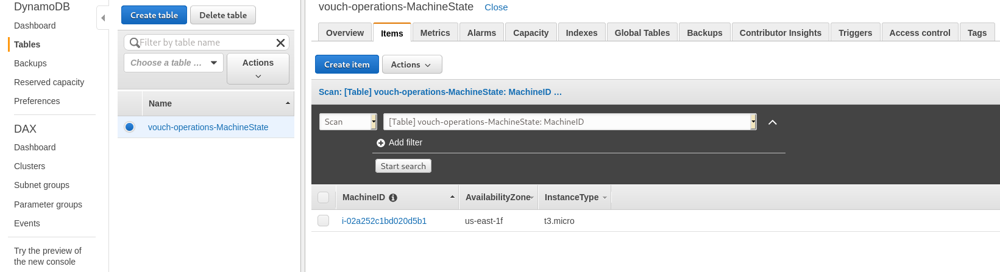

Vouch Operations Assessment

Prerequisites

    1. aws account
         create the iam user
           access_key
           secret_key 
    2. terraform
    3. SSH Key

execution steps

    $ export AWS_ACCESS_KEY_ID="xxxxxxxxx"
    $ export AWS_SECRET_ACCESS_KEY="xxxxx"
    $ export AWS_DEFAULT_REGION="us-east-1"

commands

    $ terraform init
    $ terraform fmt
    $ terraform validate
    $ terraform plan -var-file=input.tfvars
    $ terraform apply -var-file=input.tfvars

    delete the resources

    $ terraform destroy -var-file=input.tfvars 

Results

